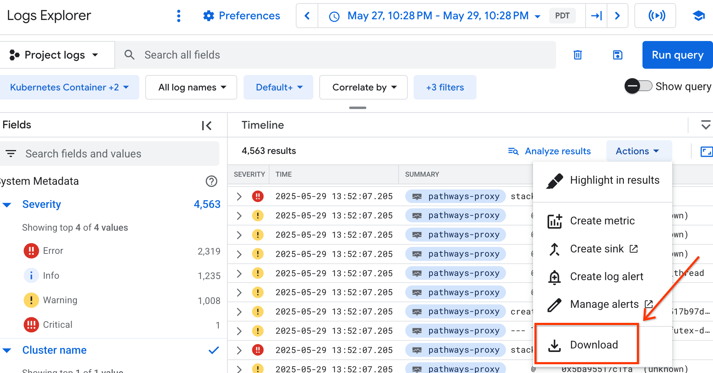
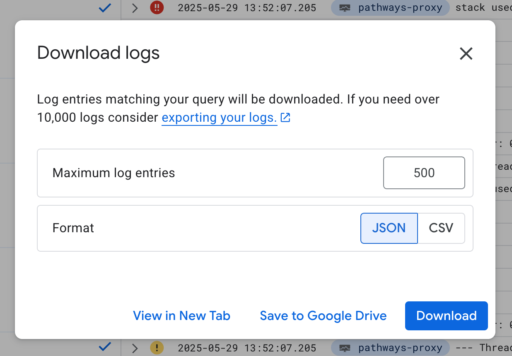
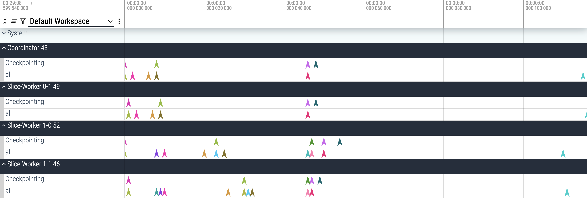

<!--
 Copyright 2023 Google LLC
 
 Licensed under the Apache License, Version 2.0 (the "License");
 you may not use this file except in compliance with the License.
 You may obtain a copy of the License at
 
      https://www.apache.org/licenses/LICENSE-2.0
 
 Unless required by applicable law or agreed to in writing, software
 distributed under the License is distributed on an "AS IS" BASIS,
 WITHOUT WARRANTIES OR CONDITIONS OF ANY KIND, either express or implied.
 See the License for the specific language governing permissions and
 limitations under the License.
 -->
# Example usage of mltrace

## Step 1: Download the logs

You can download your workload logs from the GCP console.





Note that this option has a max limit of 10k on the number of logs to download.
If you're looking to download more logs, you can create a sink and export your
logs as mentioned on the screenshot above. (See Step#4 and #5 below.)

## Step 2: Run the mltrace tool

```
python3 run_mltrace.py -f <filepath> -j <jobset_name>
```

## Step 3: Upload the traces on Perfetto



## Step 4 (Optional): Export logs to GCS

If you have a large number of logs, you can export them to GCS using a sink.

```
python3 run_mltrace.py -g <gcs_bucket_path> -j <jobset_name>
```

This command will download the logs from the GCS bucket and process them.

## Step 5 (Optional): Export logs to BigQuery

If you have a large number of logs, you can export them to BigQuery.

```
python3 run_mltrace.py -b <bigquery_table_path> -j <jobset_name>
```

This command will download the logs from the BigQuery table and process them.
